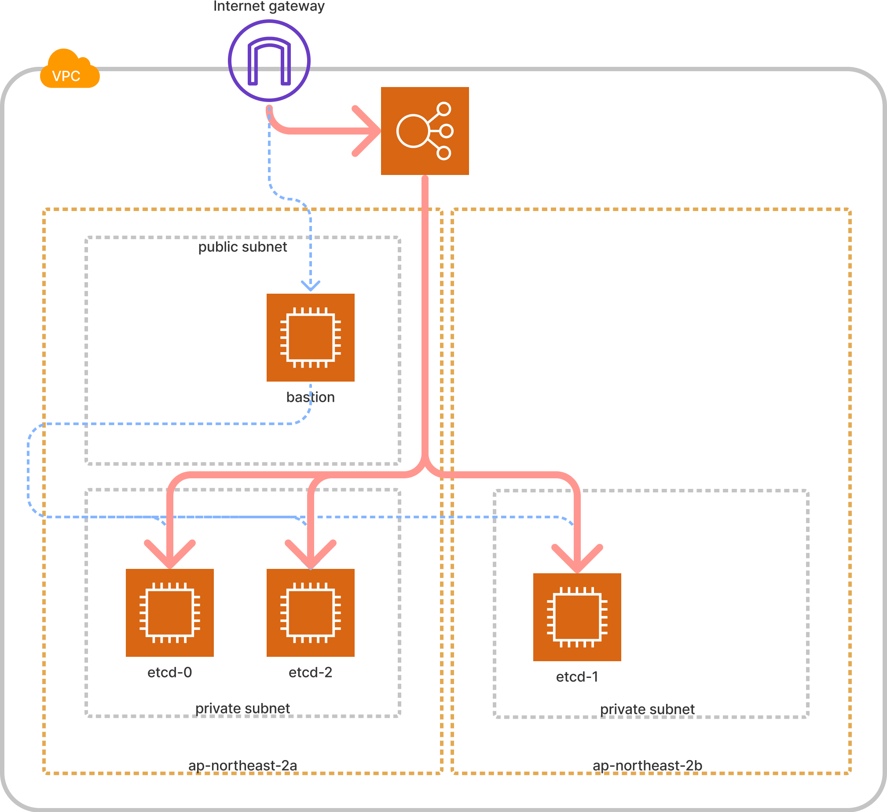

# `etcd` Cluster


## Objectives
- Provision etcd cluster

## Prerequisite
- terraform

## Architecture diagram



## How to build
```shell
$ terraform init
$ terraform plan
$ terraform apply
```

## Test with bastion instance

### Test etcd instance via bastion instance
```shell
$ ssh -A -i agd-etcd.pem -J <BASTION-USER>@<BASTION-PUBLIC-IP> <ETCD-USER>@<ETCD-PRIVATE-IP>
```

### Test etcd cluster at bastion instance
```shell
$  curl -X POST <ALB-URL>:2379/v3/cluster/member/list
```


## How to destroy
```shell
$ terraform destroy
```

## TO-DO
- Certification
- gRPC Load balancer


## Reference
- https://cloudinit.readthedocs.io/en/latest/
- https://www.terraform.io/language/functions/templatefile
- https://etcd.io/docs/v3.4/platforms/aws/
- https://etcd.io/docs/v3.4/op-guide/clustering/#etcd-discovery
